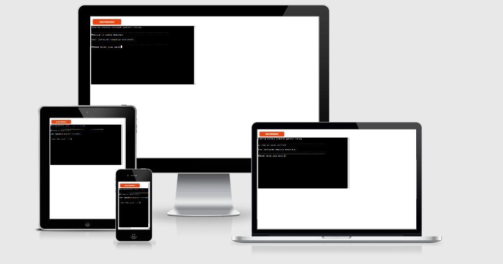

# Insta-assistant

Insta-assistant is a Python terminal social media assistant. Insta-assistant is running on Code Institutes mock terminal on Heroku. The app is for small to medium business owners who are not so familar with instagram or who just want to prepare a budget for a instagram ad campaign.

Users can uses this app to generate recommendations for a successful instgram social media campaign. In addiiton they can also get financial projections on how much it will cost them to run their ad.

The app will ask the user a series of questions and if/when all inputs are correct it will generate a summary result.

Click here for the live version of Insta-assistant: https://insta-assistant.herokuapp.com/

## How to use the app

The app is fairly easy to use. It will ask you a few simple questions about the type of socia media page you have, and you simply answer them by entering an input. Once you have inputed your answer simple press enter and it will move on to the question.

The questions are short, and failry straight forward. So anyone should be able to answer theem.

The app starts with questions about your profile, this is so that it detirmines what type of profile you have. 

After the profile questions,the app will ask the user about their ad campaign. Using these figures, it will calculate the costs that will be incurred by you/the user.

Apart from the users names, all other inputs are numbers, and if all inputs are correct the app willl generate a summary of a basic layout on how your ad campiagn should look.

All this information will be displayed in an easy to ready display at the end.

## Features

### Existing Features

Profile matching

Your profile is matched to type of industry profile it belongs to. Using that data it is determined what the best times to post are. In addition an example a hashtags for that profile is given.

Recommendations

The app generates a recommendations on what type hashtags are best for the size/number of followers the users profile has. 

It also gives recommendations on what days and times are best to post

Calculations

A calculation on how much the total cost of the ad campaign will be.

A calculation on what the average cost per day of the ad campaign will be.

## Future Features

Hashtag generators
In the future versions of the app, it will generate hashtags that will suit the profile and the type of product the users plans on running in the ad campaign.

Auto-find profile data
The user will not have to answer questions about their followers, and industry etc. They will just need to enter their Instagram profile and the app will use an API to get those details.

Print out
The will be an option to print out the apps findings so that the user will not need to re-enter their details again.

## Data Model

I used dictionaries as my model. These hold the basic data information of the various industry categories one can find on Instagram. The app has 9 dictionaries, which match the 9 possible inputs for what type of industry the user is in.

I also use the int() methods to convert inputs from strings to integers, and the round() method which gives a number that is more readable to the user. In addition, other methods also help the app, such as the print.

I user the try to ensure that the correct data in entered by the use and to handle the error in the event that the user enters the wrong data.

## Testing 

I manually tested the application using the following actions:

1. Passed the code in a code validator
2. Raised errors for invalid inputs, and looped the input until a valid input is entered
3. I tested it using my local terminal and the Code Institute Heroku terminal

## Bugs

### Solved Bugs 

1. My lines were too long, I used lines breaks to fix this.
2. I had wrong indentations at some parts of my code, which i fixed by correcting the spaces in the code.
3. When I tried to match the users inputs to the objects using if statements in industry_indetifier(), I was getting errors, because I had forgotten that the inputs were strings and needed to converted to integers. I fixed this by converting the inputs to integers using int(). 

### Remaining Bugs

1. No remaining bugs

## Validator Testing 

1. PEP8

No errors were returned form the PEP8 online validator

## Deployment 

This project has been deployed on Heroku using the Code Institute mock terminal

### Steps for Deployment:
Push main page of this repository
Create a new Heroku app
Set Python and NodeJs in this order is buildbacks
Connect Heroku to repository
Click deploy

## Credits
All code and algorithms used are my own.

I used Facebook to find out what the prices of boosting a post are.

And I researched information from https://sproutsocial.com on what the best times to post are
